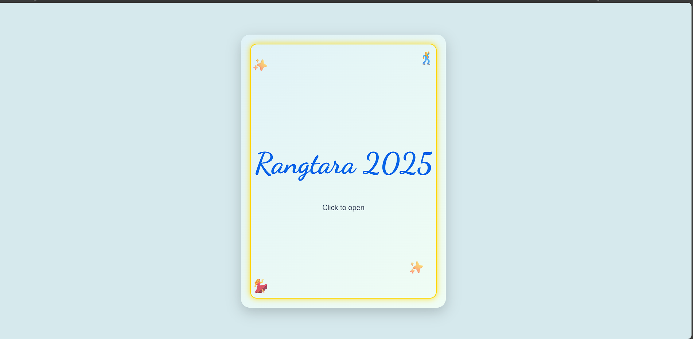

Rangtara 2025 – Fresher’s Party Invitation 🎉

📌 Overview
This is a digital invitation card for the Fresher’s Party Rangtara 2025.
It is an interactive web-based invitation built using HTML, CSS, and JavaScript.

✨ Features
Elegant card-style design
Interactive “Click to Open” invitation
Minimal and responsive UI
Custom animations & icons

🚀 Tech Stack
HTML5
CSS3 (with animations & styling)
JavaScript (for interactivity)

📂 Project Structure
/project-folder
  ├── index.html
  ├── style.css
  ├── script.js
  └── assets/ (icons, images, etc.)

🖥️ How to Run
Clone this repository:
git clone https://vinaygkp.github.io/Invitation-card/

📸 Preview
